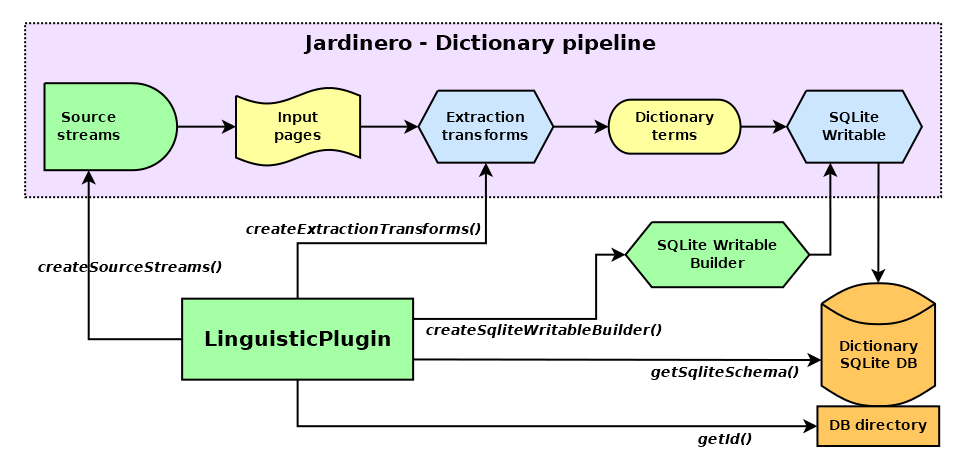

# JardineroJS - SDK

_TypeScript kit for creating JardineroJS linguistic plugins_


[](https://badge.fury.io/js/@giancosta86%2Fjardinero-sdk)
[](/LICENSE)



**JardineroJS - SDK** is the _TypeScript_ library enabling developers to create plugins for [JardineroJS](https://github.com/giancosta86/JardineroJS) - the **NodeJS** implementation of the _wiki-based architecture_ devoted to _linguistic analysis_.

Basically speaking, a plugin is a concrete subclass of `LinguisticPlugin`, providing JardineroJS with:

- a **unique id** - used, for example, to allocate _a dedicated SQLite database_ for each plugin

- instructions related to the process of _dictionary creation_:

  - the _DDL code_ to set up the **SQLite schema**

  - the chain of **source streams** - that will be parsed to _extract wiki pages_

  - the chain of **transform streams** to _extract data_ - especially **terms** - _from each wiki page_

  - the `SqliteWritableBuilder` - from the [sqlite-writable](https://github.com/giancosta86/sqlite-writable) library - used to create the `Writable` stream that _will store the above data to the SQLite db_

## Installation

```bash
npm install @giancosta86/jardinero-sdk
```

or

```bash
yarn add @giancosta86/jardinero-sdk
```

The public API entirely resides in the root package index, so you shouldn't reference specific modules.

## Usage

In order to create a _linguistic plugin_ for JardineroJS, you'll need to:

1. Import the `LinguisticPlugin` abstract class and extend it:

   ```typescript
   import { LinguisticPlugin } from "@giancosta86/jardinero-sdk";

   export class MyLinguisticPlugin extends LinguisticPlugin {
     //Here, implement the abstract methods
   }
   ```

1. **Export the custom plugin class itself** - usually, _in the index module of your package_ - and mark it as **the default export**:

   ```typescript
   export default MyLinguisticPlugin;
   ```

1. To run your plugin in JardineroJS, you'll need to invoke the **jardinero** command, passing the **module id** (usually, the path) of the above module

## Implementing LinguisticPlugin

- `getId()`: must return a `string` that identifies your plugin in a unique way; an effective strategy could be a reverse-domain notation à la Java, but the choice is yours. Please, note that _each plugin has an isolated db_, whose path is

  > $HOME/.jardinero/\<plugin id\>/dictionary.db

- `getSqliteSchema()`: must return **the DDL code** executed _when initializing the db_

- `createSourceStreams()`: an array containing a **Readable** stream, maybe followed by a sequence of **Transform** streams; the output of the last stream in the sequence will be piped into JardineroJS's [WikiTransform](https://github.com/giancosta86/wiki-transform), used to extract _wiki pages_ from the source streams

- `createPageTransforms()`: an array containing one or more **Transform** streams; this chain of transforms receives the _wiki pages_ from JardineroJS and must return _objects that will be serialized to the plugin's SQLite db_

- `createSqliteWritableBuilder()`: must return a `SqliteWritableBuilder` - provided by the [sqlite-writable](https://github.com/giancosta86/sqlite-writable) library.

  In particular, you'll probably need to call a few methods of the newly-instantiated builder, before returning it:

  - `.withType<T>`: to _register each type_ that will flow to the db

  - `.withMaxObjectsInTransaction()`: setting a value higher than the default might be hyper-effective in terms of _performances_ when storing _remarkable quantities_ of items

**Please, note**: when implementing `LinguisticPlugin`:

- every method can return the described type `T`, but `Promise<T>` is equally accepted. You can even mix sync- and async-methods. The only exception is `getId()`, that must _always_ return `string`

- in lieu of an _array_, a method can actually return _just a single item_, with no array notation. In both cases, the above sync/async note still applies

## Optional methods

Optionally, a plugin can override predefined behavior:

- `translateQueryToSql()`: since every Jardinero plugin reads data from its dedicated SQLite database, this method allows you to translate the input query written by the user, within the UI, into the actual SQL code executed by the db - thus enabling the creation of arbitrary domain-specific languages. It can return a `string` or a `Promise<string>` - whichever you prefer. By default, it just returns the input query, assuming the user is already writing SQL code.

## Logging

Your method implementations can access the `this.logger` field, whose `Logger` type is declared by the [unified-logging](https://github.com/giancosta86/unified-logging) library.

## Further reference

- Please, feel free to explore the [CervantesJS](https://github.com/giancosta86/CervantesJS) project - a vast plugin dedicated to the analysis of the _Spanish language_

- [JardineroJS](https://github.com/giancosta86/JardineroJS) - the web architecture itself
